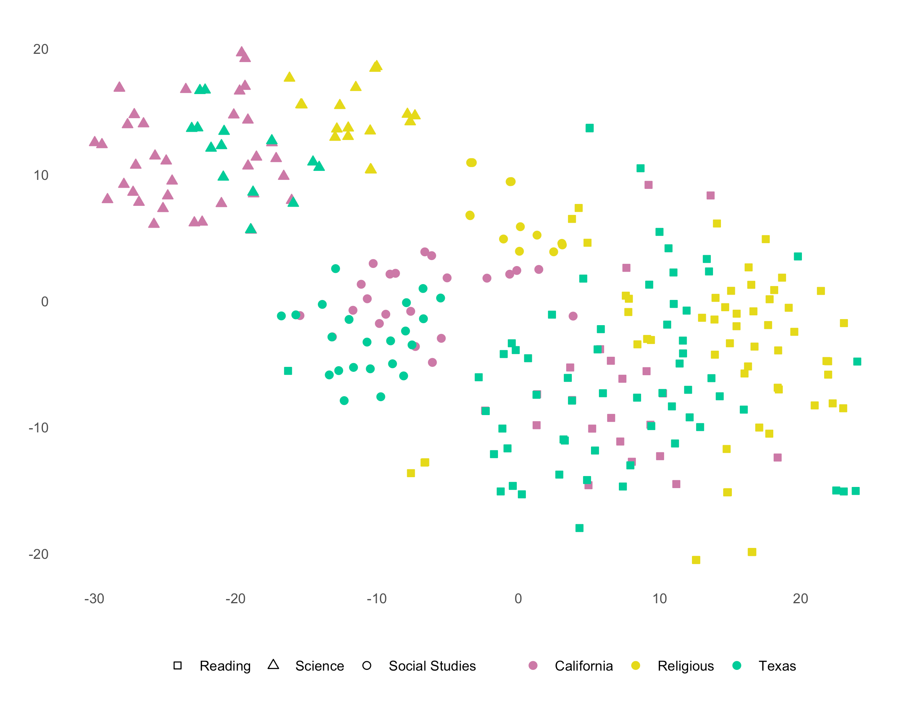
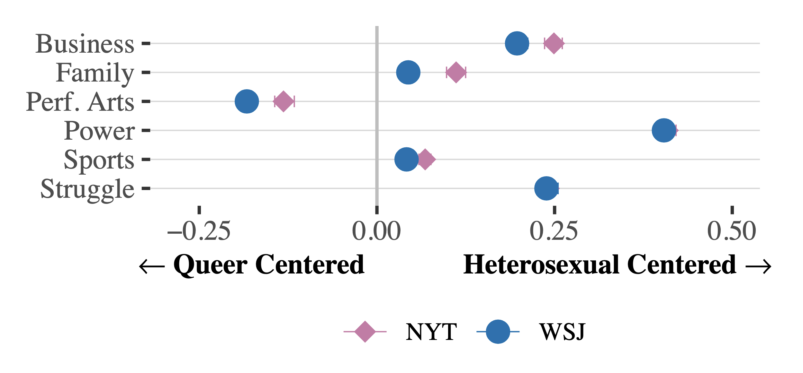
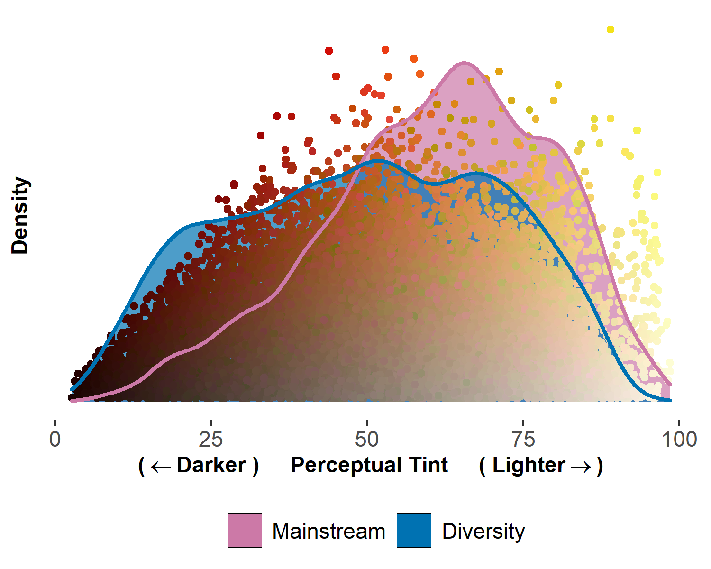
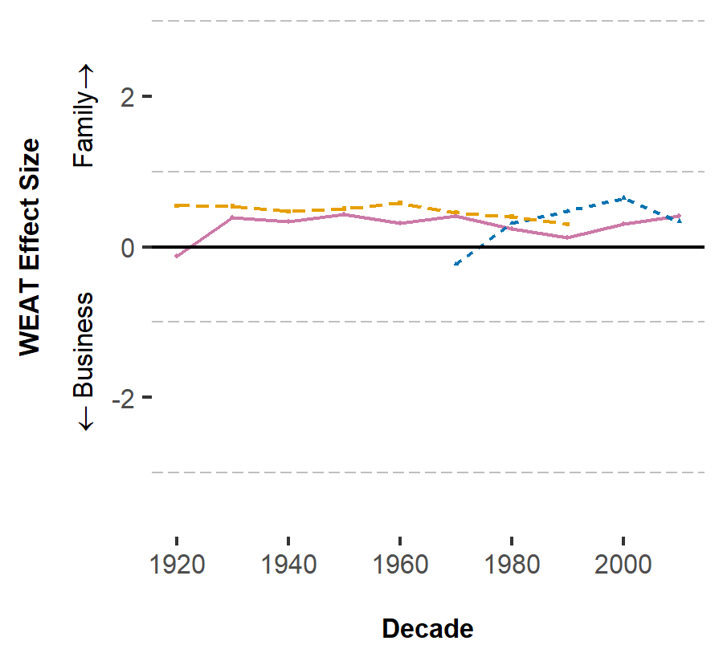
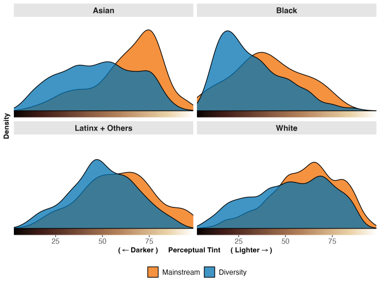
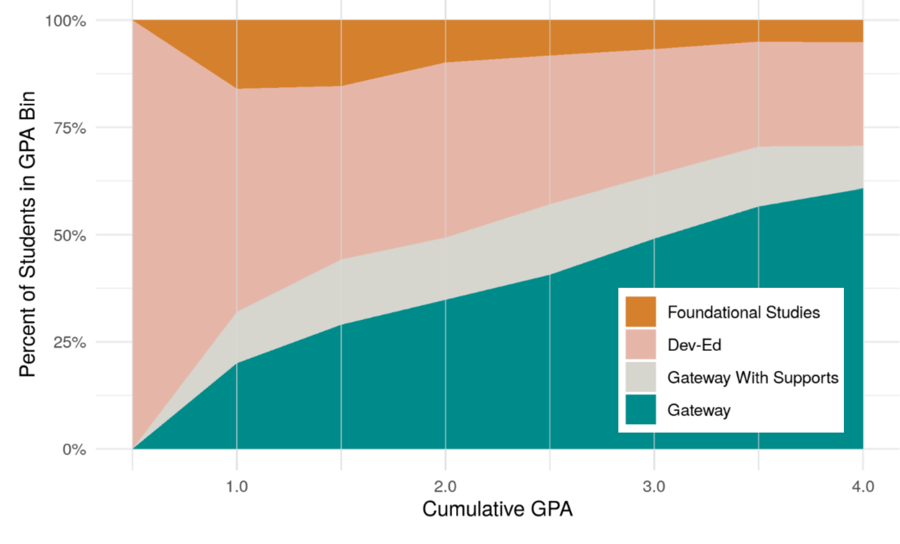

   
   

#  **Working Papers**

#### “Impact of Free Community College: Evidence From Chicago”  **(Job Market Paper)**  
##### *with <a href="https://kellyhallberg.wordpress.com/">Kelly Hallberg</a>*  

**Permission for public dissemination of results in progress. Draft available upon request (harrisone@uchicago.edu)**
      
##### **Abstract**  

*As the cost of college continues to rise, free community college has emerged as a strategic policy intervention aimed at improving access to higher education and alleviating the burden of student loans. While free community college offers a potentially lower-cost pathway through college, limiting financial aid exclusively to community colleges might have unintended consequences if it diverts students from attending better-resourced 4-year universities, which typically have higher completion rates. This study examines the impact of the Star Scholarship, a merit-based promise program in Chicago offering free community college tuition for high school graduates with at least a 3.0 GPA.  Using a regression discontinuity design, we examine the effect of this policy on not only college enrollment and degree completion but also on college major choices and effort in high school. Furthermore, we explore differential impacts across student subgroups, including low-income students and those likely to be undocumented. This study contributes to our broader understanding of how financial aid design affects economic opportunity for different groups of students, providing valuable insights for policymakers aiming to increase college access and success.  *

 

   

  

#### “Separation of Church and State Curricula? Examining Public and Religious Private School Textbooks”  <a href="https://uchicago.box.com/s/q2a1biy9smrtvbkdp0as1pi2ie8y7yzb">**(Job Market Paper)**</a>   
##### *with <a href="https://voices.uchicago.edu/anjali/research/">Anjali Adukia</a>*

      
##### **Abstract**  
 

*Curricular materials not only impart knowledge but also instill values and shape collective memory. Growth in U.S. school choice programs has increased public funds directed to religious schools, but little is known about what they teach. We examine textbooks from religious educational settings and from public schools in Texas and California, applying and improving upon computer vision and natural language processing tools to measure topics, values, representation, and portrayal over time. Political polarization suggests a narrative of divergence, but our analysis reveals meaningful parallels between the public school collections overall, while religious textbooks differ notably, featuring less female representation, characters with lighter skin, more  White individuals, and differential portrayal of topics such as evolution and religion. Important similarities, however, also emerge: for example, each collection portrays females in contexts that are more positive but less active and powerful than males, and depicts the U.S. founding era and slavery in similar contexts.*

   

  

#### “Category Embeddings Measure Intersectional Portrayals” (Revision Invited at Nature) 
##### *with <a href="https://voices.uchicago.edu/anjali/research/">Anjali Adukia</a> and <a href="http://www.alexeble.com/">Alex Eble</a>*
      
##### **Abstract**  

*Traditional natural language processing tools, which depend on frequent mentions of individual names associated with different identities to measure the context in which different identities are portrayed, have proven effective in uncovering gender bias. However, they fall short in accurately representing other historically marginalized groups due to their infrequent mention. This issue is exacerbated when examining the intersection of two underrepresented groups, whose combined identities are even less represented. To address this limitation, we introduce "Category Embeddings," an innovative approach that leverages traditional word embedding techniques to estimate a single embedding for a set of names associated with a given identity category in contrast to prior approaches that estimate separate embeddings for each individual name. This method enhances the capacity to measure representation of intersectional experiences and significantly improves the accuracy of representation analyses in smaller text samples across all identities. We demonstrate the flexibility of our method through two distinct applications. First, we measure how race-gender identities are portrayed in a century of highly influential children’s books. We find that Black females are most likely associated with struggle and performance arts, Black males with sports and struggle, White females with family and performance arts, and White males with power and business. Second, we measure the representation of queer individuals of different races and genders in two major U.S. newspapers. We find that queer individuals are more likely to be associated with performance arts and less likely to be associated with power than heterosexual individuals of the same race or gender.*

  
  

#  **Peer-Reviewed Publications** 

#### “What We Teach About Race and Gender: Representation in Images and Text of Children’s Books”   <a href="https://doi.org/10.1093/qje/qjad028"> Quarterly Journal of Economics</a> (November 2023)

##### *with <a href="https://voices.uchicago.edu/anjali/research/">Anjali Adukia</a>, <a href="http://www.alexeble.com/">Alex Eble</a>, <a href="https://scholar.google.com/citations?user=yS83xSkAAAAJ&hl=en">H. Birali Runesha</a>, and <a href="https://github.com/DoraSzasz">Teodora Szasz</a>*

 
      
##### **Abstract**  

*Books shape how children learn about society and social norms, in part through the representation of different characters. To better understand the messages children encounter in books, we introduce new machine-led methods for systematically converting images into data. We apply these image tools, along with established text analysis methods, to measure the representation of race, gender, and age in children’s books commonly found in US schools and homes over the last century. We find that books selected to highlight people of color, or females of all races, consistently depict characters with darker skin tones than characters in "mainstream" books, which depict lighter-skinned characters even after conditioning on perceived race. Children are depicted with lighter skin than adults, despite no biological foundation for such a difference. Females are more represented in images than in text, suggesting greater symbolic inclusion in pictures than substantive inclusion in stories. Relative to the US Census, Black and Latinx people are underrepresented; whereas males, particularly White males, are persistently overrepresented. Our data provide a view into the "black box" of education through children’s books in US schools and homes, highlighting what has changed and what has endured over time.*

[Press: <a href="https://time.com/6284174/book-bans-black-children-publishing/">Time Magazine</a>, <a href="https://www.wsj.com/articles/jack-and-the-bean-counters-a-woke-childrens-story-11619199026">Wall Street Journal</a>, <a href="https://www.slj.com/?detailStory=new-study-looks-race-gender-representation-in-award-winning-childrens-books&utm_source=editorial&utm_medium=SLJTW&utm_term=&utm_content=&utm_campaign=articles">School Library Journal</a>, <a href="https://soundcloud.com/codetogether/scivis-unveils-a-billion-cells-covid-19-invisible-monsters">Code Together</a>, <a href="https://inequalitalks.fireside.fm/19">Inequalitalks</a>, <a href="https://www.future-ed.org/what-we-teach-about-race-and-gender/">FutureEd</a>, <a href="https://www.the74million.org/article/study-ai-uncovers-skin-tone-gap-in-most-beloved-childrens-books/">The 74</a>, Named one of the ten most significant studies of 2021 by George Lucas Foundation’s <a href="https://www.edutopia.org/article/10-most-significant-education-studies-2021">Edutopia</a>]

   

   

#### “Tales and Tropes: Gender Roles from Word Embeddings in a Century of Children’s Books”   <a href="https://aclanthology.org/2022.coling-1.273.pdf">Proceedings of the 28th International Conference on Computational Linguistics</a> (October 2022)
      
##### *with <a href="https://voices.uchicago.edu/anjali/research/">Anjali Adukia</a>, <a href="https://scholar.google.com/citations?user=AzsyeyIAAAAJ&hl=en">Patricia Chiril</a>, <a href="https://www.linkedin.com/in/callista-christ/">Callista Christ</a>, <a href="https://www.linkedin.com/in/anjali-das-629869169/">Anjali Das</a>, <a href="www.alexeble.com">Alex Eble</a>, and <a href="https://scholar.google.com/citations?user=yS83xSkAAAAJ&hl=en">H. Birali Runesha</a>*

##### **Abstract**

*The manner in which gender is portrayed in materials used to teach children conveys messages about people’s roles in society. In this paper, we measure the gendered depiction of central domains of social life in 100 years of highly influential children’s books. We make two main contributions: (1) we find that the portrayal of gender in these books reproduces traditional gender norms in society, and (2) we publish StoryWords 1.0, the first word embeddings trained on such a large body of children's literature. We find that, relative to males, females are more likely to be represented in relation to their appearance than in relation to their competence; second, they are more likely to be represented in relation to their role in the family than their role in business. Finally, we find that non-binary or gender-fluid individuals are rarely mentioned. Our analysis advances understanding of the different messages contained in content commonly used to teach children, with immediate applications for practice, policy, and research.*
  

   

   

#### “Measuring Representation of Race, Gender, and Age in Children's Books: Face Detection and Feature Classification in Illustrated Images”   <a href="https://openaccess.thecvf.com/content/WACV2022/papers/Szasz_Measuring_Representation_of_Race_Gender_and_Age_in_Childrens_Books_WACV_2022_paper.pdf">Proceedings of the IEEE/CVF Winter Conference on Applications of Computer Vision</a> (January 2022)
      
##### *with <a href="https://github.com/DoraSzasz">Teodora Szasz</a>, <a href="https://github.com/howard5758">Ping-Jung Liu</a>, <a href="https://scholar.google.com/citations?user=SYitLx8AAAAJ&hl=en">Ping-Chang Lin</a>, <a href="https://scholar.google.com/citations?user=yS83xSkAAAAJ&hl=en">H. Birali Runesha</a>, and <a href="https://voices.uchicago.edu/anjali/research/">Anjali Adukia</a>*

##### **Abstract**

*Images in children's books convey messages about society and the roles that people play in it. Understanding these messages requires systematic measurement of who is represented. Computer vision face detection tools can provide such measurements; however, state-of-the-art face detection models were trained with photographs, and 80% of images in children's books are illustrated; thus existing methods both misclassify and miss classifying many faces. In this paper, we introduce a new approach to analyze images using AI tools, resulting in data that can assess representation of race, gender, and age in both illustrations and photographs in children's books.*
  

    
  
  

#  **Other Publications**

 

  

#### “What Award Winning Books Teach Children About Race and Gender" <a href="https://www.brookings.edu/blog/brown-center-chalkboard/2023/06/02/what-award-winning-childrens-books-teach-children-about-race-and-gender/">The Brown Center Chalkboard</a> (June 2023)  

##### *with <a href="https://voices.uchicago.edu/anjali/research/">Anjali Adukia</a>, <a href="http://www.alexeble.com/">Alex Eble</a>*  

  

  

#### “Redesigning Developmental Education Placement Policies: A Case Study of City Colleges of Chicago’s Approach” <a href="https://urbanlabs.uchicago.edu/attachments/3852964a1741b2115b89c7939d5f829a801a2797/store/0492ff6810730e3681fbbc3bcdcdcf3edae7348addfff6f514e78cc1d2bc/City+Colleges+of+Chicago+Developmental+Education+Case+Study+Report_vFINAL.pdf">The Inclusive Economy Lab</a> (May 2023)  

##### *with <a href="https://kellyhallberg.wordpress.com/">Kelly Hallberg</a>, <a href="https://urbanlabs.uchicago.edu/people/stephen-stapleton">Stephen Stapleton</a>, and <a href="https://www.linkedin.com/in/kafi-moragne-patterson-phd-913372135/">Kafi Moragne-Patterson</a>*  
  
 

   
   
  

#  **Selected Works In Progress**

#### “Unpacking the Long-Term Impact of Holistic Supports for Community College Students”
*with Kelly Hallberg and Marianne Bertrand*
&nbsp;  

#### “Skin Color, Marriage Markets, and Women's Empowerment in Bangladesh”   
*with Anjali Adukia, Nina Buchmann, Erica Field, and Rachel Glennerster*
&nbsp;  

#### “Influencing Identities: The Impact of Content Creators on Character Representation and Portrayal”
*with Anjali Adukia and Jake Nicoll* 

   
   
  
   
   

