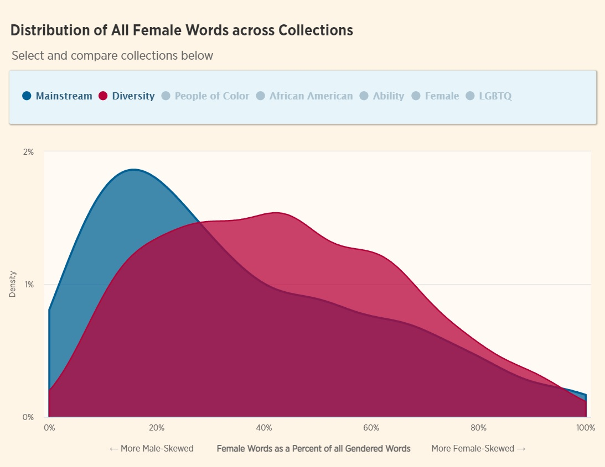

&nbsp;

#  **Working Papers** 

#### “What We Teach About Race and Gender: Representation in Images and Text of Children’s Books” <a href="https://bfi.uchicago.edu/wp-content/uploads/2021/04/BFI_WP_2021-44.pdf"> (April 2021, Becker Friedman Institute Working Paper 2021-44)</a>
      
##### *with <a href="https://voices.uchicago.edu/anjali/research/">Anjali Adukia</a>, <a href="http://www.alexeble.com/">Alex Eble</a>, <a href="https://scholar.google.com/citations?user=yS83xSkAAAAJ&hl=en">H. Birali Runesha</a>, and <a href="https://github.com/DoraSzasz">Teodora Szasz</a>*

&nbsp;

##### **Abstract**

*Books shape how children learn about society and social norms, in part through the representation of different characters. To better understand the messages children encounter in books, we introduce new machine-led methods for systematically converting images into data. We apply these image tools, along with established text analysis methods, to measure the representation of race, gender, and age in children’s books commonly found in US schools and homes over the last century. We find that books selected to highlight people of color, or females of all races, consistently depict characters with darker skin tones than characters in "mainstream" books, which depict lighter-skinned characters even after conditioning on perceived race. Children are depicted with lighter skin than adults, despite no biological foundation for such a difference. Females are more represented in images than in text, suggesting greater symbolic inclusion in pictures than substantive inclusion in stories. Relative to the US Census, Black and Latinx people are underrepresented; whereas males, particularly White males, are persistently overrepresented. Our data provide a view into the "black box" of education through children’s books in US schools and homes, highlighting what has changed and what has endured.*

[Press: <a href="https://www.slj.com/?detailStory=new-study-looks-race-gender-representation-in-award-winning-childrens-books&utm_source=editorial&utm_medium=SLJTW&utm_term=&utm_content=&utm_campaign=articles">School Library Journal</a>, <a href="https://www.wsj.com/articles/jack-and-the-bean-counters-a-woke-childrens-story-11619199026">Wall Street Journal</a>]

&nbsp;

#  **Works In Progress**

  
#### “The Effect of Automatic Transfer Admission on Community College Student Outcomes”
  
&nbsp;  
  
#### “Allocating Need-Based Grants Under Scarcity”

&nbsp;  
  
#### “Heterogeneous Effects of Merit-Based Community College Scholarships”

