
   
   

#  **Working Papers**

#### “The Effect of Merit-Based Free Community College”   <a href="https://utexas.box.com/s/1y8772x1nzm75w4hfcgyge1dzrnqt3zb">**Link to Paper**</a> 
##### *with <a href="https://kellyhallberg.wordpress.com/">Kelly Hallberg</a>, Elijah Ruiz, and Marvin Slaughter*  

##### **Abstract**  
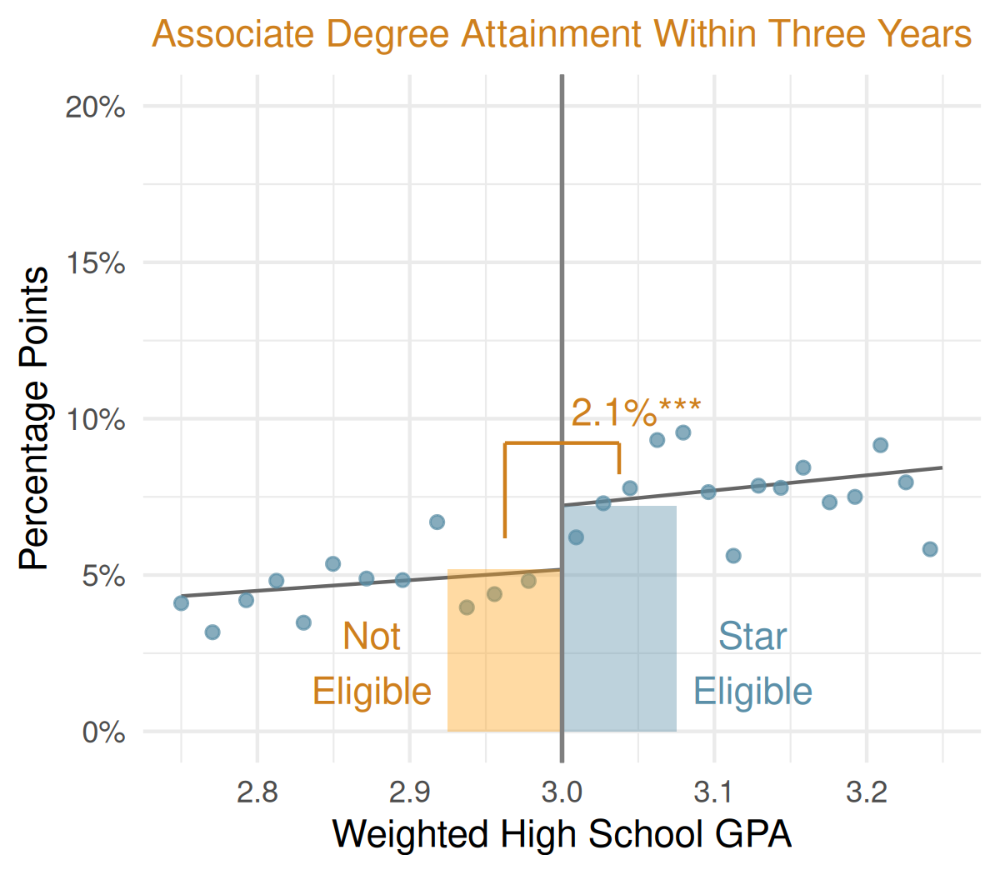

*Free community college is often promoted as a way to expand access and reduce student debt, but may have unintended consequences if it reduces bachelor's degree completion for students diverted from better resourced four-year universities. By examining a merit-based free community college program in Chicago called the Star Scholarship, we identify the impact of free community college on a distinct set of students: those likely to be deciding where to enroll rather than whether to enroll in college. Using a regression discontinuity design around the 3.0 GPA cutoff, we find that eligibility for merit-based free community college does not increase overall college enrollment, but does significantly shift students from starting at 4-year universities to first enrolling at community colleges. Notably, this diversion does not reduce the probability of eventually earning a bachelor’s degree within six years of graduating high school and eligible students are 2.1 percentage points more likely to earn an associate degree within three years. There is no evidence of a large decrease in the quality of the first college a student enrolls in nor do we see a decline in STEM degree completion for eligible students. Take-up is highest among students likely to be from immigrant families, highlighting unmet financial need among this group. These findings suggest that for the average student near the merit threshold, free community college can increase degree attainment without causing students to substitute two-year degrees for four-year degrees.*

[<a href="https://urbanlabs.uchicago.edu/attachments/3fafdca5c14d677a3827149b1ba10a9a2909743e/store/44e85fa60c97269b4039be47b548afd10226b5696c8948dd008203c79df9/StarOnePager+Final.pdf">**One Page Summary**</a>] [<a href="https://vimeo.com/1168270774?share=copy&amp;fl=sv&amp;fe=ci">**Webinar**</a>] [Press: <a href="http://www.lawndalenews.com/2026/02/uchicago-inclusive-economy-lab-report-finds-chicago-star-scholarship-increases-college-completion/">**Lawndale News**</a>]

   

  

#### “Separation of Church and State Curricula? Public Standards, Private Values, and Textbook Content” **(Revision Invited at The Review of Economic Studies, Resubmitted)** <a href="https://utexas.app.box.com/s/zal5sb3b11saipgd0e38ihu3gxw5fm6r">**Link to Paper**</a> 
##### *with <a href="https://voices.uchicago.edu/anjali/research/">Anjali Adukia</a>*

      
##### **Abstract**  
<a href="https://www.nber.org/papers/w33791?utm_campaign=ntwh&utm_medium=email&utm_source=ntwg2">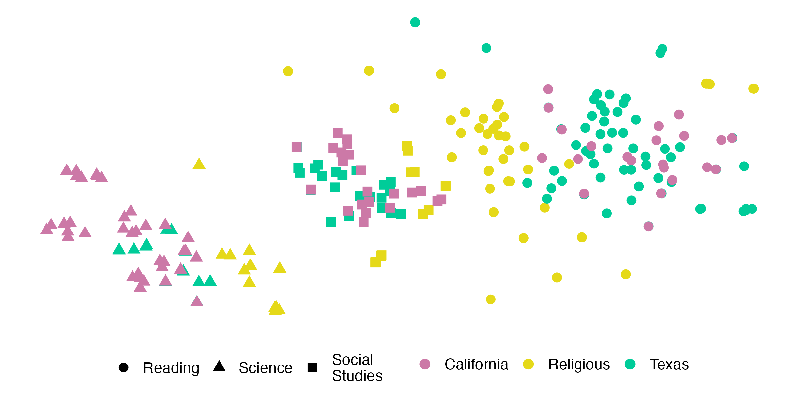</a> 

*Curricula are a critical site of cultural transmission, yet we know little about the values conveyed in textbooks across educational settings or the forces that shape them. We examine textbooks from Texas and California public schools and religious-private and home schools spanning 1980-2022, using computational and AI tools to measure presence and portrayal of people, topics, and values over time. Despite narratives of political polarization, Texas and California textbooks show substantial similarity. In contrast, religious private-school textbooks place greater emphasis on religious and character values and depict characters with lighter skin colors; we show these differences align with preferences and demographics of target markets. To explain public-school convergence, we develop a framework in which publishers serve a national market constrained by state standards and provide evidence consistent with cross-state spillovers in textbook content following standards revisions. Conversely, private-school publishers serve a more segmented, less regulated market, leading to greater differentiation.*

[Press: <a href="https://parentdata.org/kids/race-in-childrens-books/">**ParentData Podcast**</a>]

 

  

#### “Unpacking the Long-Term Impact of Holistic Supports for Community College Students” <a href="https://edworkingpapers.com/ai26-1428">**Link to Paper**</a>  
##### *with <a href="https://kellyhallberg.wordpress.com/">Kelly Hallberg</a>, Elijah Ruiz, and Marvin Slaughter*  
  
##### **Abstract**  
<a href="https://edworkingpapers.com/ai26-1428">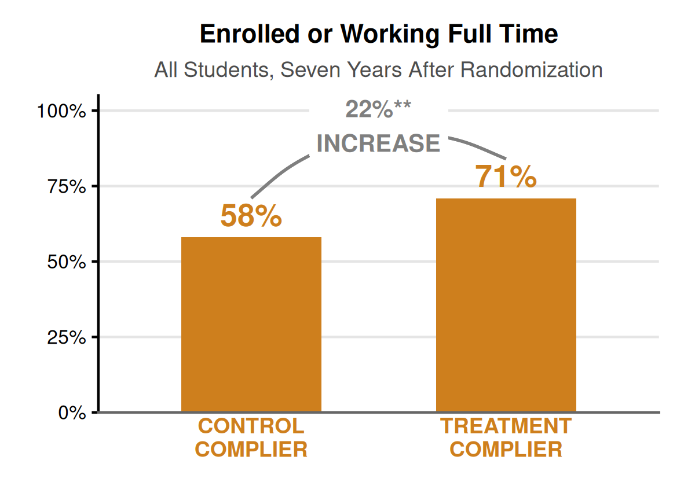</a> 

*This paper presents longer-term findings from a randomized controlled trial of One Million Degrees (OMD), a comprehensive support program for community college students in the Chicago metro area that provides financial, academic, personal, and professional assistance. Results from an initial evaluation found that an offer of a spot in the OMD program led to increased college enrollment, persistence, and associate degree attainment three years after randomization. With eight years of follow-up, we find that these effects persist, indicating the program causes applicants to enroll in and complete more degrees rather than solely accelerating completion. The impacts are concentrated among students who applied while still in high school compared to continuing community college students. For high school applicants, participation in OMD significantly improved labor market outcomes: in every year after randomization, they were more likely to be enrolled in school full time or employed full time, and by year seven they earned higher wages and held more stable jobs. For students already enrolled in community college, effects on labor market outcomes are positive but not statistically significant. For both high school and community college applicants, we observe positive, albeit insignificant, effects on bachelor’s degree attainment eight years after randomization. Taken together, these findings suggest that OMD improves long-term employment outcomes with effects operating through both increased degree attainment as well as the broader benefits of mentoring and advising. Compared to other holistic support models, we find smaller (though less precise) effects for students already in college, but larger gains in long-run attainment and earnings for students applying directly from high school. This highlights the importance of extending holistic supports to students at the critical decision stage of initial college entry, rather than limiting the offer of supports to those who have already enrolled.*

[**No Spin Evidence Review:** <a href="https://nospin.evidencebasedpolicy.org/articles/one-million-degrees-comprehensive-support-program-community-college-students">Accurately Reported</a>] [Press: <a href="https://www.ccdaily.com/2026/03/the-long-term-labor-benefits-of-student-supports/">**Community College Daily**</a>,  <a href="https://www.easternprogress.com/new-study-chicago-based-program-drove-significant-gains-in-graduation-rates-and-career-outcomes-for/article_62ff2a1c-b54c-5fdd-abf7-378350970d89.html">**Eastern Progress**</a>, <a href="https://www.abetterchicago.org/grantees/one-million-degrees">**A Better Chicago**</a>]

 

  

#### “(How) Do We Teach Emotions?” <a href="https://utexas.box.com/s/iwc8bincrahxijp1up6b05i23wisty4a">**Link to Paper**</a>  
##### *with <a href="https://voices.uchicago.edu/anjali/research/">Anjali Adukia</a>, <a href="https://lawecon.ethz.ch/group/scientific-team/bonci.html">Matt Bonci</a>, <a href="https://pauladastresg.github.io/index.html">Paula Dastres</a>, <a href="https://jwnicoll.github.io/">Jake Nicoll</a>, and <a href="https://github.com/DoraSzasz">Teodora Szasz</a>*
  
##### **Abstract**  
<a href="https://utexas.box.com/s/iwc8bincrahxijp1up6b05i23wisty4a">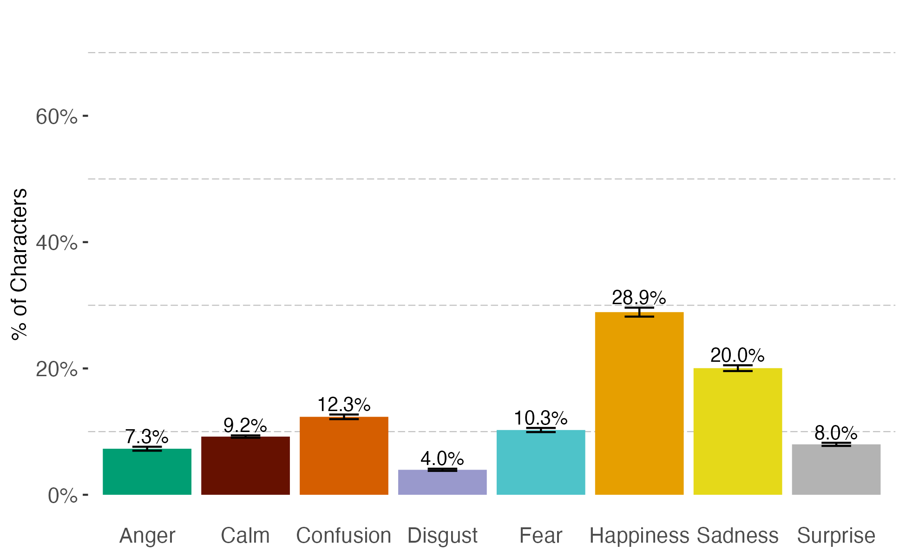</a> 

*Emotional intelligence is a key component of human capital, shaped in part by the educational materials children consume. These materials send messages about the emotional reactions that are and are not socially appropriate. In this study, we apply natural language processing and computer vision tools to examine the emotional representations conveyed in the text and images of influential educational materials: public school elementary textbooks and award winning children's literature. Our analysis reveals a stark mismatch between the emotions children read about and the ones they see in images. We find that textual context exposes children to a diverse emotional landscape, including happiness, sadness, anger, and calm, all with relatively balanced frequency. In contrast, pictured characters overwhelmingly display happiness and calm, while ``negatively'' valenced emotions rarely appear. This pattern persists across time, genre categories, and demographic subgroups in our corpus. Using individual-level book purchases and library inventory data, we provide evidence that the overrepresentation of happy and calm emotions in visual content reflect supply-side responses to consumer preferences.*

 

  

#### “Supporting the Early Academic Momentum of Community College Students: Examining the Impact of Incorporating GPA into Course Placement” <a href="https://urbanlabs.uchicago.edu/attachments/eeef833dbee46f3e7221dc0525e43afe44c76ad7/store/673250c624a4cedb93fcb889359064411de631f5b2505f2962054b691b61/Dev+Ed+White+Paper_FINAL+.pdf">**Link to Paper**</a>  
##### *with <a href="https://kellyhallberg.wordpress.com/">Kelly Hallberg</a>, Adam Leader-Smith, Elijah Ruiz, Marvin Slaughter, and Courtney Washington*  
  
##### **Abstract**  
<a href="https://urbanlabs.uchicago.edu/attachments/eeef833dbee46f3e7221dc0525e43afe44c76ad7/store/673250c624a4cedb93fcb889359064411de631f5b2505f2962054b691b61/Dev+Ed+White+Paper_FINAL+.pdf">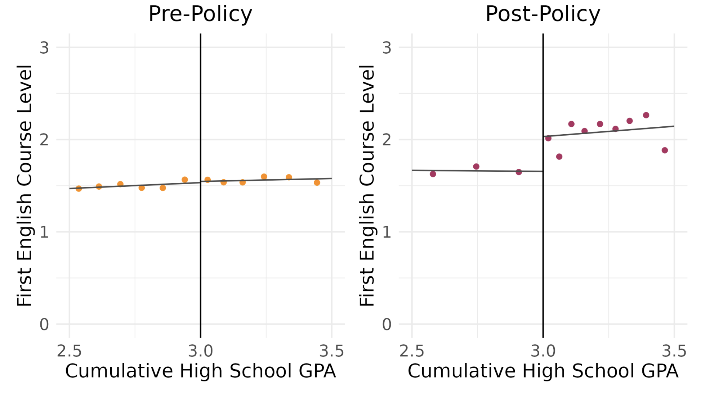</a> 

*Placing community college students into their first math or English course is a critical decision with significant implications. Students placed into coursework that is too challenging may struggle to persist, while those placed into unnecessary developmental coursework may experience reduced academic momentum, delayed graduation, and increased costs. Recent research has found that using multiple measures for placement, like high school GPA alongside standardized test scores, can improve placement accuracy and student’s academic outcomes. This study assesses the impact of a new multiple measure placement policy at City Colleges of Chicago, which “boosts” students with a high school GPA of 3.0 or above into higher math and English course levels, reducing their need for developmental education. In practice, the math and English placement boost applied to fewer than 5 percent and 8 percent of students, respectively, with even fewer students taking advantage of the boosted placement. Despite the small number of affected students, using a difference in regression discontinuity design we find that access to a placement boost in math or English courses decreased the number of developmental courses taken by students without affecting overall academic performance or persistence. However, it also led to delayed course-taking for these required math and English courses. Qualitative findings from interviews with students revealed a lack of awareness about the policy, suggesting a need for better communication and easier transcript sharing between Chicago Public Schools and City Colleges to maximize policy benefits.*

  

<!--     -->
<!-- 
 -->
<!--    -->

<!-- #### “Category Embeddings Measure Intersectional Portrayals”  -->
<!-- ##### *with <a href="https://voices.uchicago.edu/anjali/research/">Anjali Adukia</a> and <a href="http://www.alexeble.com/">Alex Eble</a>* -->

<!-- ##### **Abstract**   -->
<!-- 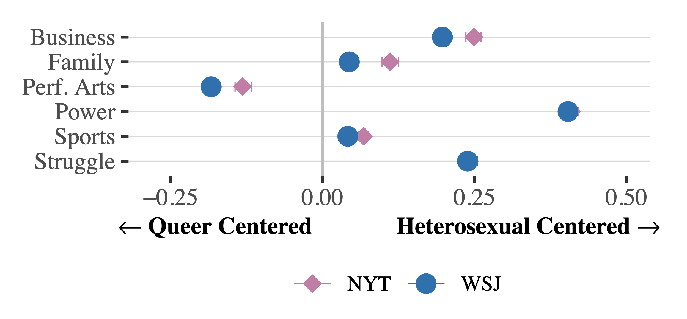 -->
<!-- 
*Traditional natural language processing tools, which depend on frequent mentions of individual names associated with different identities to measure the context in which different identities are portrayed, have proven effective in uncovering gender bias. However, they fall short in accurately representing other historically marginalized groups due to their infrequent mention. This issue is exacerbated when examining the intersection of two underrepresented groups, whose combined identities are even less represented. To address this limitation, we introduce "Category Embeddings," an innovative approach that leverages traditional word embedding techniques to estimate a single embedding for a set of names associated with a given identity category in contrast to prior approaches that estimate separate embeddings for each individual name. This method enhances the capacity to measure representation of intersectional experiences and significantly improves the accuracy of representation analyses in smaller text samples across all identities. We demonstrate the flexibility of our method through two distinct applications. First, we measure how race-gender identities are portrayed in a century of highly influential children’s books. We find that Black females are most likely associated with struggle and performance arts, Black males with sports and struggle, White females with family and performance arts, and White males with power and business. Second, we measure the representation of queer individuals of different races and genders in two major U.S. newspapers. We find that queer individuals are more likely to be associated with performance arts and less likely to be associated with power than heterosexual individuals of the same race or gender.*
 -->

  
  

#  **Peer-Reviewed Publications** 

#### “What We Teach About Race and Gender: Representation in Images and Text of Children’s Books”   <a href="https://doi.org/10.1093/qje/qjad028"> Quarterly Journal of Economics</a> (November 2023)

##### *with <a href="https://voices.uchicago.edu/anjali/research/">Anjali Adukia</a>, <a href="http://www.alexeble.com/">Alex Eble</a>, <a href="https://scholar.google.com/citations?user=yS83xSkAAAAJ&hl=en">H. Birali Runesha</a>, and <a href="https://github.com/DoraSzasz">Teodora Szasz</a>*

<a href="https://academic.oup.com/qje/advance-article/doi/10.1093/qje/qjad028/7247000">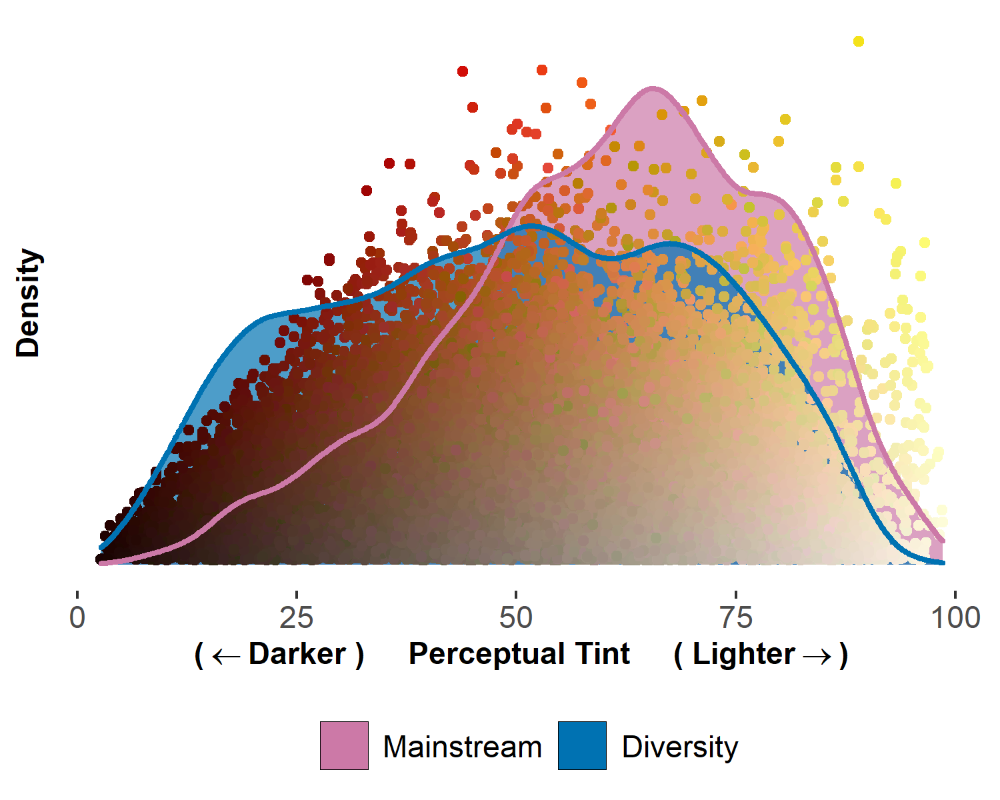</a> 
      
##### **Abstract**  

*Books shape how children learn about society and social norms, in part through the representation of different characters. To better understand the messages children encounter in books, we introduce new machine-led methods for systematically converting images into data. We apply these image tools, along with established text analysis methods, to measure the representation of race, gender, and age in children’s books commonly found in US schools and homes over the last century. We find that books selected to highlight people of color, or females of all races, consistently depict characters with darker skin tones than characters in "mainstream" books, which depict lighter-skinned characters even after conditioning on perceived race. Children are depicted with lighter skin than adults, despite no biological foundation for such a difference. Females are more represented in images than in text, suggesting greater symbolic inclusion in pictures than substantive inclusion in stories. Relative to the US Census, Black and Latinx people are underrepresented; whereas males, particularly White males, are persistently overrepresented. Our data provide a view into the "black box" of education through children’s books in US schools and homes, highlighting what has changed and what has endured over time.*

[Press: <a href="https://time.com/6284174/book-bans-black-children-publishing/">Time Magazine</a>, <a href="https://www.wsj.com/articles/jack-and-the-bean-counters-a-woke-childrens-story-11619199026">Wall Street Journal</a>, <a href="https://www.slj.com/?detailStory=new-study-looks-race-gender-representation-in-award-winning-childrens-books&utm_source=editorial&utm_medium=SLJTW&utm_term=&utm_content=&utm_campaign=articles">School Library Journal</a>, <a href="https://soundcloud.com/codetogether/scivis-unveils-a-billion-cells-covid-19-invisible-monsters">Code Together</a>, <a href="https://inequalitalks.fireside.fm/19">Inequalitalks</a>, <a href="https://www.future-ed.org/what-we-teach-about-race-and-gender/">FutureEd</a>, <a href="https://www.the74million.org/article/study-ai-uncovers-skin-tone-gap-in-most-beloved-childrens-books/">The 74</a>, Named one of the ten most significant studies of 2021 by George Lucas Foundation’s <a href="https://www.edutopia.org/article/10-most-significant-education-studies-2021">Edutopia</a>]

   

   

#### “Tales and Tropes: Gender Roles from Word Embeddings in a Century of Children’s Books”   <a href="https://aclanthology.org/2022.coling-1.273.pdf">Proceedings of the 28th International Conference on Computational Linguistics</a> (October 2022)
      
##### *with <a href="https://voices.uchicago.edu/anjali/research/">Anjali Adukia</a>, <a href="https://scholar.google.com/citations?user=AzsyeyIAAAAJ&hl=en">Patricia Chiril</a>, <a href="https://www.linkedin.com/in/callista-christ/">Callista Christ</a>, <a href="https://www.linkedin.com/in/anjali-das-629869169/">Anjali Das</a>, <a href="www.alexeble.com">Alex Eble</a>, and <a href="https://scholar.google.com/citations?user=yS83xSkAAAAJ&hl=en">H. Birali Runesha</a>*

##### **Abstract**
<a href="https://openaccess.thecvf.com/content/WACV2022/papers/Szasz_Measuring_Representation_of_Race_Gender_and_Age_in_Childrens_Books_WACV_2022_paper.pdf">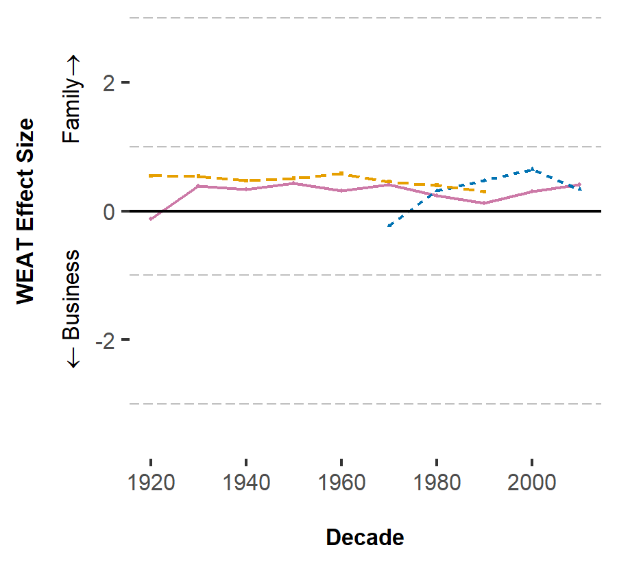</a>
*The manner in which gender is portrayed in materials used to teach children conveys messages about people’s roles in society. In this paper, we measure the gendered depiction of central domains of social life in 100 years of highly influential children’s books. We make two main contributions: (1) we find that the portrayal of gender in these books reproduces traditional gender norms in society, and (2) we publish StoryWords 1.0, the first word embeddings trained on such a large body of children's literature. We find that, relative to males, females are more likely to be represented in relation to their appearance than in relation to their competence; second, they are more likely to be represented in relation to their role in the family than their role in business. Finally, we find that non-binary or gender-fluid individuals are rarely mentioned. Our analysis advances understanding of the different messages contained in content commonly used to teach children, with immediate applications for practice, policy, and research.*
  

   

   

#### “Measuring Representation of Race, Gender, and Age in Children's Books: Face Detection and Feature Classification in Illustrated Images”   <a href="https://openaccess.thecvf.com/content/WACV2022/papers/Szasz_Measuring_Representation_of_Race_Gender_and_Age_in_Childrens_Books_WACV_2022_paper.pdf">Proceedings of the IEEE/CVF Winter Conference on Applications of Computer Vision</a> (January 2022)
      
##### *with <a href="https://github.com/DoraSzasz">Teodora Szasz</a>, <a href="https://github.com/howard5758">Ping-Jung Liu</a>, <a href="https://scholar.google.com/citations?user=SYitLx8AAAAJ&hl=en">Ping-Chang Lin</a>, <a href="https://scholar.google.com/citations?user=yS83xSkAAAAJ&hl=en">H. Birali Runesha</a>, and <a href="https://voices.uchicago.edu/anjali/research/">Anjali Adukia</a>*

##### **Abstract**
<a href="https://openaccess.thecvf.com/content/WACV2022/papers/Szasz_Measuring_Representation_of_Race_Gender_and_Age_in_Childrens_Books_WACV_2022_paper.pdf">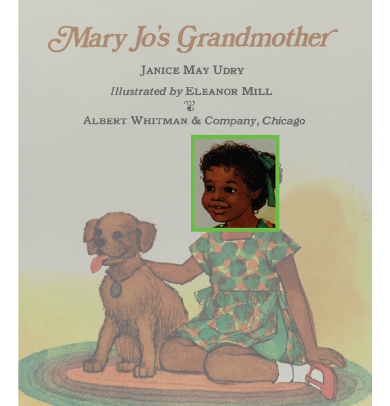</a>
*Images in children's books convey messages about society and the roles that people play in it. Understanding these messages requires systematic measurement of who is represented. Computer vision face detection tools can provide such measurements; however, state-of-the-art face detection models were trained with photographs, and 80% of images in children's books are illustrated; thus existing methods both misclassify and miss classifying many faces. In this paper, we introduce a new approach to analyze images using AI tools, resulting in data that can assess representation of race, gender, and age in both illustrations and photographs in children's books.*
  

    
  
  

#  **Other Publications**

 

  
 
#### “Redesigning Developmental Education Placement Policies: A Case Study of City Colleges of Chicago’s Approach” <a href="https://urbanlabs.uchicago.edu/attachments/3852964a1741b2115b89c7939d5f829a801a2797/store/0492ff6810730e3681fbbc3bcdcdcf3edae7348addfff6f514e78cc1d2bc/City+Colleges+of+Chicago+Developmental+Education+Case+Study+Report_vFINAL.pdf">The Inclusive Economy Lab</a> (May 2023)  

##### *with <a href="https://kellyhallberg.wordpress.com/">Kelly Hallberg</a>, <a href="https://urbanlabs.uchicago.edu/people/stephen-stapleton">Stephen Stapleton</a>, and <a href="https://www.linkedin.com/in/kafi-moragne-patterson-phd-913372135/">Kafi Moragne-Patterson</a>*  
  
<a href="https://urbanlabs.uchicago.edu/attachments/3852964a1741b2115b89c7939d5f829a801a2797/store/0492ff6810730e3681fbbc3bcdcdcf3edae7348addfff6f514e78cc1d2bc/City+Colleges+of+Chicago+Developmental+Education+Case+Study+Report_vFINAL.pdf">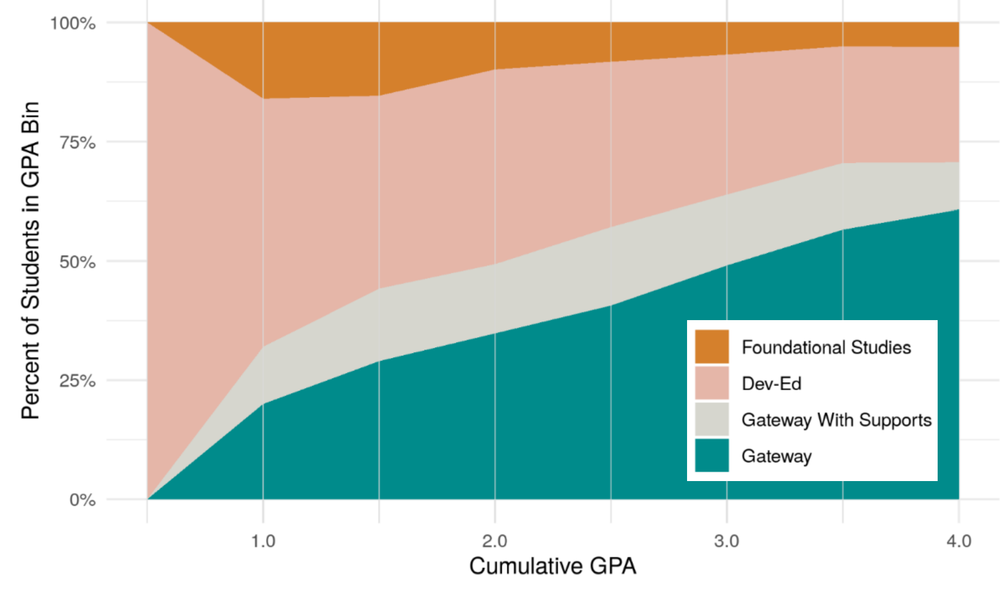</a> 

 

  

#### “What Award Winning Books Teach Children About Race and Gender" <a href="https://www.brookings.edu/blog/brown-center-chalkboard/2023/06/02/what-award-winning-childrens-books-teach-children-about-race-and-gender/">The Brown Center Chalkboard</a> (June 2023)  

##### *with <a href="https://voices.uchicago.edu/anjali/research/">Anjali Adukia</a>, <a href="http://www.alexeble.com/">Alex Eble</a>*  

<a href="https://www.brookings.edu/blog/brown-center-chalkboard/2023/06/02/what-award-winning-childrens-books-teach-children-about-race-and-gender/">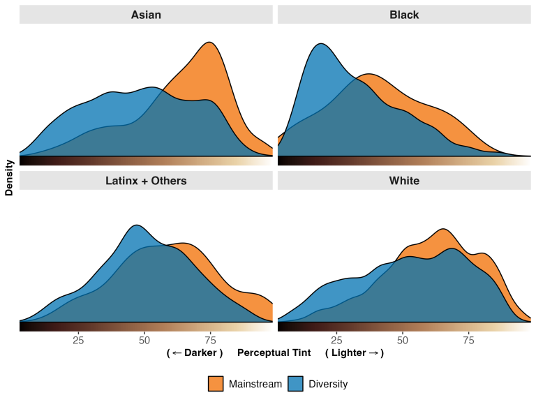</a>

   
   
  

#  **Selected Works In Progress**

#### “Natural  Disasters, Labor  Markets, and Economic Mobility of Young Adults”
*with Mythili Vinnakota*
&nbsp;  

#### “Community College Deserts and Labor Market Outcomes”
*with Riley Acton, Kalena E. Cortes, Lois Miller, and Camila Morales*
&nbsp;  

#### “Skin Color, Marriage Markets, and Women's Empowerment in Bangladesh”   
*with Anjali Adukia, Nina Buchmann, Erica Field, and Rachel Glennerster*
&nbsp;  

#### “Influencing Identities: The Impact of Content Creators on Character Representation and Portrayal”
*with Anjali Adukia and Jake Nicoll* 

   
   
  
   
   

